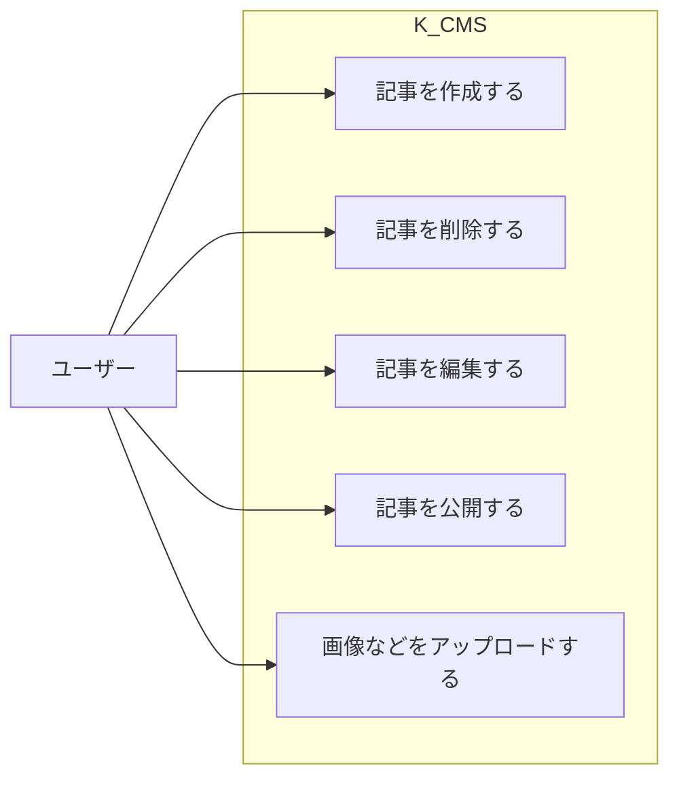

# ヘッドレスCMS
## ユースケース

## 機能一覧
- 記事の作成
  - ライブマークダウンエディター
  - 記事のプレビュー
- 記事の削除
- 記事の編集
  - 作成ページと同じUIを使用
- 記事の公開
  - 編集中は一時ディレクトリに保存、公開時は_postsへ移動
- 画像などのアップロード
  - 記事に付与されたIDをもとにディレクトリを作成して保存
  - 自動でWebpに変換

## バックエンド構成
### 必要なAPI
#### 記事一覧の取得
- GET /api/posts/list
- GET /api/posts/detail

#### 記事の作成・一時保存
- POST /api/temp/save
- GET /api/temp/load
- DELETE /api/temp/delete

#### 記事の公開
- POST /api/posts/publish

#### 記事の編集
- GET /api/edit/load
- POST /api/edit/save
- POST /api/edit/delete

#### 画像のアップロード
- POST /api/upload/image
- POST /api/upload/delete
- GET /api/upload/list

### フロントエンド構成
#### Next.js
- ライブマークダウンプレビューを実装
- 管理ページのUIを実装